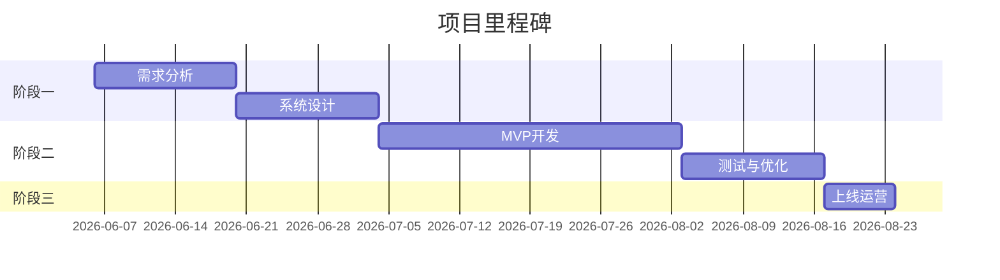

# 项目主页

## 项目概览

**项目名称**：床垫二手交易平台（MattressMarket）  
**技术栈**：TypeScript  
**创建日期**：2026-06-06  
**当前阶段**：需求分析

## 文档导航

### 📁 01-项目启动
- [[项目章程]] - 项目基本信息与目标
- [[可行性分析]] - 市场、技术、经济可行性评估
- [[干系人分析]] - 项目相关方识别

### 📁 02-需求分析
- [[用户故事]] - 用户角色与场景描述
- [[用例图]] - 系统功能用例
- [[功能需求规格说明书]] - 详细功能需求
- [[非功能需求]] - 性能、安全、可用性要求

### 📁 03-系统设计
- [[系统架构设计]] - 整体架构方案
- [[数据库设计]] - 数据模型与表结构
- [[API设计]] - 接口规范
- [[UI/UX设计]] - 界面原型

### 📁 04-技术选型
- [[技术栈对比]] - 各技术方案对比分析
- [[开发环境搭建]] - 环境配置指南
- [[编码规范]] - 代码风格与规范

### 📁 05-开发计划
- [[迭代计划]] - 版本规划与里程碑
- [[任务分解]] - WBS工作分解
- [[风险管理]] - 风险识别与应对

### 📁 06-会议记录
- 按日期存放各类会议纪要

## 快速链接

- 📊 [[项目章程|项目章程]]
- 📋 [[用户故事|用户故事]]
- 🏗️ [[系统架构设计|系统架构]]

## 项目时间线

---

*最后更新：2026-06-06*